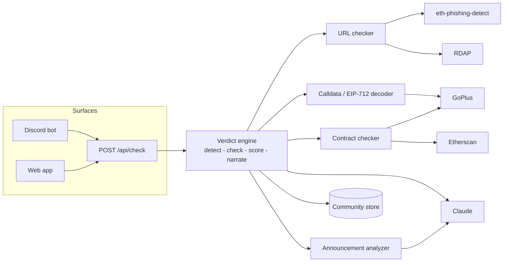

# exSafe — Product Requirements & Progress Document

**exSafe — NFT Community Safety Desk**
_One clear verdict on any link, contract, transaction, or announcement — before a member connects a wallet or signs._

| | |
|---|---|
| **Status** | ✅ MVP shipped & live |
| **Live** | https://exsafe-mu.vercel.app |
| **Repo** | `exsafe/` (Next.js 16 · TypeScript) |
| **Context** | Vibeathon submission — Wave 1 founder track |
| **Last updated** | 2026-07-21 |

---

## Contents
1. [Overview](#1-overview)
2. [Problem](#2-problem)
3. [Goals & non-goals](#3-goals--non-goals)
4. [Target users](#4-target-users)
5. [Features & status](#5-features--status)
6. [Architecture](#6-architecture)
7. [The verdict engine](#7-the-verdict-engine)
8. [Data sources](#8-data-sources)
9. [API reference](#9-api-reference)
10. [Data model](#10-data-model)
11. [Graceful degradation](#11-graceful-degradation)
12. [Deployment](#12-deployment)
13. [Progress log](#13-progress-log)
14. [Roadmap](#14-roadmap)
15. [Risks & limitations](#15-risks--limitations)
16. [Success metrics](#16-success-metrics)
17. [Appendix](#17-appendix)

---

## 1. Overview

exSafe is a **security desk for NFT communities**. A member pastes anything they're
unsure about — a mint link, a contract address, a transaction they're about to sign,
or a suspicious Discord announcement — and exSafe returns a single, human-readable
verdict: 🟢 **SAFE**, 🟡 **CAUTION**, or 🔴 **DANGER**, with a plain-language reason
and a concrete recommendation.

It is built as **one verdict engine ("the brain") exposed through many surfaces**:
a web app, a Discord bot that auto-scans messages, and a public API. A crowd-sourced
community layer (per-server allowlists/blocklists) makes it more than "another
scanner" — it's operated by and for a community.

---

## 2. Problem

- Wallet drainers steal **hundreds of millions of dollars a year** (Scam Sniffer).
- The vast majority happens through **one bad signature** (`setApprovalForAll`,
  `Permit`, Permit2, Seaport) or **one fake link** dropped in a compromised Discord.
- At the decisive moment, wallets like MetaMask show a **wall of hex** and ask
  "Sign?" — with no human-readable context about what is actually being authorized.
- NFT communities are the primary attack surface: non-technical members, high FOMO
  (mints, airdrops), and mods who cannot police every link 24/7.

**Insight:** the gap is not detection data (feeds exist) — it's **translation and
distribution**: turning raw signals into a verdict a collector understands, delivered
where the community already lives.

---

## 3. Goals & non-goals

### Goals (MVP)
- Accept any of: link, contract/address, raw transaction calldata, EIP-712 signature, announcement text — **auto-detected**.
- Produce a single verdict + transparent, auditable signal checklist + plain-language explanation.
- Decode dangerous transactions/signatures and **cross-check the counterparty** against reputation feeds.
- Ship a **community layer** (allow/blocklist, reporting) scoped per community.
- Deliver via **web + Discord bot + API** from one shared engine.
- Run **with zero API keys** (graceful degradation) so anyone can try it instantly.

### Non-goals (for the MVP)
- Full transaction simulation / asset-flow diffing (roadmap — Tenderly/Alchemy).
- In-wallet integration / MetaMask Snap (roadmap).
- Multi-chain beyond EVM defaults; automated on-chain remediation (revoke) UI.
- Persistent multi-tenant database & mod dashboard (roadmap; MVP is file-backed).
- Being a guarantee of safety — exSafe surfaces risk signals, not financial advice.

---

## 4. Target users

| Persona | Pain | What exSafe gives them |
|---|---|---|
| **Collectors** | Can't read hex or spot `0pensea.io` at 2am | A verdict they understand before they connect |
| **Mods & founders** | Can't watch every link in a 20k-member server | A bot that auto-scans and warns for them |
| **The community** | One hijacked announcement drains many wallets | A shared, self-improving blocklist |

---

## 5. Features & status

| # | Feature | Description | Status |
|---|---|---|---|
| F1 | Verdict engine | Detect → check → score → narrate; one entry point (`runCheck`) | ✅ Shipped |
| F2 | Input auto-detection | url / address / calldata / typed-data / announcement | ✅ Shipped |
| F3 | Link checker | eth-phishing-detect (block/allow/fuzzy), typosquat + homoglyph, RDAP domain age | ✅ Shipped |
| F4 | Contract/address checker | GoPlus reputation + token security, Etherscan verified + age | ✅ Shipped |
| F5 | Calldata decoder | `approve`, `setApprovalForAll`, `increaseAllowance`, `permit`, Permit2, `transferFrom` | ✅ Shipped |
| F6 | Signature (EIP-712) decoder | ERC-2612 Permit, Permit2, Seaport order detection | ✅ Shipped |
| F7 | Counterparty cross-check | The address receiving an approval is checked vs GoPlus + community blocklist | ✅ Shipped |
| F8 | Announcement analyzer | Claude tactic detection + keyword fallback + embedded-link checks | ✅ Shipped |
| F9 | Claude narration | Plain-language summary/explanation/recommendation, EN/ID, deterministic fallback | ✅ Shipped |
| F10 | Community layer | Per-community allow/blocklist + reporting; seed + runtime store | ✅ Shipped |
| F11 | Web app | Single input → verdict card, signal checklist, examples, report button, EN/ID | ✅ Shipped |
| F12 | Public API | `POST /api/check`, `POST /api/report` | ✅ Shipped |
| F13 | Discord bot | Auto-scan messages, `/check`, `/report`; per-guild scope | ✅ Implemented (needs a bot token to run) |
| F14 | Live deployment | Vercel production | ✅ Live |
| F15 | Transaction simulation | Show exact asset outflow | 🔜 Roadmap |
| F16 | MetaMask Snap | In-wallet warnings at signing time | 🔜 Roadmap |
| F17 | Mod dashboard + DB | Persistent, multi-tenant community desk | 🔜 Roadmap |

---

## 6. Architecture

**One brain, many doors.** Every surface calls the same `runCheck()`.



### Tech stack
- **Next.js 16** (App Router, Turbopack) + **TypeScript** + **Tailwind CSS v4**
- **viem** — calldata/typed-data decoding
- **@anthropic-ai/sdk** — Claude narration & announcement analysis
- **discord.js** — the bot
- **zod** — API request validation
- **tsx** — run the bot without a build step

### Request flow
1. `detectInput()` classifies the raw string (JSON tx object / EIP-712 / hex / URL / text).
2. The matching checker(s) run and return `Signal[]` + a `degraded[]` note for skipped checks.
3. `scoreSignals()` combines signals into a `verdict` + `score`.
4. `narrate()` turns the structured result into a plain-language summary/explanation/recommendation (Claude, or a deterministic fallback).
5. A `CheckResult` is returned to the caller.

---

## 7. The verdict engine

### 7.1 Input detection (`lib/engine/detect.ts`)
| Input shape | Detected kind |
|---|---|
| `{ types, domain, message/primaryType }` (JSON) | `typed-data` |
| `{ data: "0x…" }` (JSON tx object) | `calldata` |
| `0x` + 40 hex | `address` |
| `0x` + ≥8 hex (even length, not 40) | `calldata` |
| single token, domain-like / has scheme | `url` |
| whitespace + ≥12 chars | `announcement` |
| otherwise | `unknown` |

### 7.2 Signals
Each check emits `Signal`s — the transparent, auditable units the UI renders as a
checklist. Severity ∈ `danger | caution | safe | info`, each with a stable `id`,
`label`, `detail`, and `source`.

### 7.3 Scoring (`lib/engine/score.ts`)
Risk points: `danger +100`, `caution +30`, `safe −20`, `info 0`; clamped 0–100.

Verdict rules, in order:
1. any `danger` signal → **DANGER** (a drainer approval is never "just caution");
2. community-verified (allowlist) and score < 20 → **SAFE**;
3. score ≥ 60 → **DANGER**;
4. score ≥ 20 → **CAUTION**;
5. otherwise → **SAFE**.

### 7.4 Decoded functions (`lib/checkers/calldata.ts`)
| Selector | Function | Severity logic |
|---|---|---|
| `0xa22cb465` | `setApprovalForAll` | `approved=true` → DANGER (+ counterparty); `false` → SAFE (revoke) |
| `0x095ea7b3` | `approve` | unlimited amount → DANGER, else CAUTION (+ counterparty) |
| `0x39509351` | `increaseAllowance` | unlimited → DANGER, else CAUTION |
| `0xd505accf` | `permit` (ERC-2612) | DANGER (off-chain drain) |
| `0x87517c45` | Permit2 `approve` | DANGER |
| `0x23b872dd` / `0x42842e0e` | `transferFrom` / `safeTransferFrom` | CAUTION |

EIP-712 typed data: ERC-2612 **Permit**, **Permit2** (PermitSingle/Batch), and
**Seaport** order signatures are recognized and explained. The **counterparty**
(spender/operator) is cross-checked against GoPlus and the community blocklist.

---

## 8. Data sources

| Source | Used for | Key required |
|---|---|---|
| **MetaMask eth-phishing-detect** | Phishing block/allow list + fuzzy typosquat match | No |
| **GoPlus Security** | Address reputation (phishing/drainer/…) + token security | No (rate-limited) |
| **Etherscan v2** | Verified source, contract age | Yes (free) |
| **RDAP** | Domain registration age | No |
| **On-chain decode (viem)** | Transaction/signature meaning | No |
| **Community store** | Per-server allowlist/blocklist + reports | No |
| **Claude** | Narration + announcement analysis | Yes (falls back) |

---

## 9. API reference

### `POST /api/check`
```jsonc
// request
{
  "input": "0x…",            // required: link / address / calldata / typed-data / text
  "chainId": "1",            // optional (default 1)
  "community": "guild-123",  // optional scope for allow/blocklist
  "lang": "en"               // optional: "en" | "id"
}
// response (CheckResult)
{
  "input": "…", "kind": "calldata", "verdict": "DANGER", "score": 100,
  "summary": "Grants access to ALL your NFTs",
  "explanation": "…", "recommendation": "Do not connect your wallet…",
  "signals": [
    { "id": "approval-all", "label": "…", "severity": "danger", "detail": "…", "source": "…" }
  ],
  "meta": { "chainId": "1", "chainName": "Ethereum", "checkedAt": "…",
            "degraded": [], "aiNarrated": true }
}
```

### `POST /api/report`
```jsonc
{ "value": "scam.xyz", "type": "domain", "list": "block",
  "community": "guild-123", "reason": "…" }   // → { ok: true, entry }
```

---

## 10. Data model

```ts
type SignalSeverity = "danger" | "caution" | "safe" | "info";
type Verdict = "SAFE" | "CAUTION" | "DANGER";
type InputKind = "url" | "address" | "calldata" | "typed-data" | "announcement" | "unknown";

interface Signal { id; label; severity; detail; source?; evidence?; }
interface CheckResult {
  input; kind; verdict; score; signals;
  summary; explanation; recommendation;
  meta: { chainId?; chainName?; checkedAt; degraded: string[]; aiNarrated?; };
}

// Community store entry
interface CommunityEntry { value; type: "domain" | "address"; list: "allow" | "block";
  reason?; community?; reporter?; at?; }
```

---

## 11. Graceful degradation

The product is designed so **no key is mandatory**:
- **No `ANTHROPIC_API_KEY`** → deterministic narration; announcement analyzer uses keyword heuristics.
- **No `ETHERSCAN_API_KEY`** → verified-source & contract-age signals skipped (noted in `meta.degraded`).
- **GoPlus / eth-phishing-detect / RDAP / community** → no key needed.
- Any source that errors is caught and recorded in `meta.degraded`; the verdict still returns.

This is what makes the live demo work instantly and never hard-fail.

---

## 12. Deployment

- **Live:** https://exsafe-mu.vercel.app (Vercel, project `exsafe`).
- **Web + API:** deploy with `vercel --prod` from `exsafe/` (project linked). Next.js auto-detected.
- **Discord bot:** long-running process — run locally (`npm run bot`) or host on Railway/Render; point `EXSAFE_API_URL` at the deployment. Requires a Discord token + **Message Content Intent**.
- **Community store on serverless:** writes fall back to `/tmp` on read-only hosts; seed list is always readable. Production persistence = swap for a DB (roadmap). See `DEPLOY.md`.

---

## 13. Progress log

**Milestones achieved**
- ✅ Project scaffolded (Next.js 16 + TS + Tailwind v4) and dependencies installed.
- ✅ Verdict engine: types, input detection, scoring rubric, orchestrator.
- ✅ Four checkers: URL, contract/address, calldata + EIP-712 decoder, announcement.
- ✅ Counterparty reputation cross-check for approvals/permits.
- ✅ Claude narration + announcement analysis, with deterministic/keyword fallbacks.
- ✅ Community allow/blocklist store (+ serverless-safe persistence) and reporting.
- ✅ `POST /api/check` and `POST /api/report`.
- ✅ Web UI: verdict card, signal checklist, examples, chain selector, EN/ID, report.
- ✅ Product landing sections ("How it works", "Who it's for", positioning).
- ✅ Discord bot: auto-scan + `/check` + `/report` (per-guild scope).
- ✅ Env config (`.env.example`), README, DEMO script, DEPLOY guide, pitch deck.
- ✅ Deployed to Vercel production.

**Verification performed**
- `tsc --noEmit` — clean.
- `next build` — clean (routes: `/` static, `/api/*` dynamic).
- Live API on production: `opensea-mint.net` → DANGER; `opensea.io` → SAFE;
  drainer `setApprovalForAll` calldata → DANGER (+ counterparty flagged);
  scam announcement → DANGER (tactics + embedded blocklisted link).
- Report round-trip: report a domain → immediate re-check returns DANGER.
- Bot boots under `tsx` (import/ESM verified; exits cleanly without a token).

---

## 14. Roadmap

**Near term**
- Transaction **simulation** (Tenderly / Alchemy) — show exact asset outflow.
- Signature decoding depth: full Permit2 batch / Seaport line-item breakdown.
- Wallet **permission audit** (revoke.cash-style) surface.

**Mid term**
- **MetaMask Snap** for in-wallet warnings at signing time.
- Persistent **database** + mod dashboard for the community desk.
- Multi-chain expansion (Base, Polygon, Arbitrum, …) beyond defaults.

**Product / business**
- Free for communities; premium threat feeds, analytics, and dashboard.
- Bot-led, server-to-server distribution as the growth loop.

---

## 15. Risks & limitations

- **Not a guarantee.** Absence of a signal is not proof of safety; the UI says so.
- **RDAP coverage** is incomplete (e.g. `.io` isn't in the bootstrap) — degrades gracefully.
- **GoPlus without a key** is rate-limited; heavy use needs a key.
- **Community store** is file-backed (MVP); serverless persistence is per-instance until a DB is added.
- **Seed community data** is sample data; real phishing coverage comes from the live feeds.
- **Announcement heuristics** (no-key mode) are coarser than the Claude path.

---

## 16. Success metrics

- **Activation:** a member gets a verdict in < 5s from paste.
- **Coverage:** % of pasted scam links/contracts correctly flagged (test set of known scams).
- **Distribution:** number of Discord servers with the bot installed; links auto-scanned/day.
- **Community health:** reports submitted, blocklist entries per server, repeat usage.
- **Trust:** verdicts with an explanation a non-technical user rates as "clear".

---

## 17. Appendix

### Repository layout
```
exsafe/
├─ app/
│  ├─ page.tsx            # landing + <Desk/>
│  ├─ desk.tsx            # interactive client component
│  ├─ layout.tsx, globals.css
│  └─ api/
│     ├─ check/route.ts   # POST /api/check
│     └─ report/route.ts  # POST /api/report
├─ lib/
│  ├─ engine/{types,detect,score,index}.ts
│  ├─ checkers/{base,url,contract,calldata,announcement}.ts
│  ├─ data/{goplus,phishingList}.ts
│  ├─ ai/{client,narrate}.ts
│  ├─ community/store.ts
│  └─ config.ts
├─ bot/index.ts           # Discord bot
├─ data/community.json    # seed allow/blocklist
├─ README.md · DEMO.md · DEPLOY.md · PRD.md
└─ exSafe-pitch.pptx
```

### Environment variables
See `.env.example`. All optional: `ANTHROPIC_API_KEY`, `ANTHROPIC_MODEL`,
`ETHERSCAN_API_KEY`, `GOPLUS_APP_KEY/SECRET`, `DEFAULT_CHAIN_ID`, `NARRATION_LANG`,
`DISCORD_BOT_TOKEN`, `DISCORD_CLIENT_ID`, `DISCORD_GUILD_ID`, `EXSAFE_API_URL`.

### Demo inputs → expected verdict
| Input | Verdict |
|---|---|
| `opensea.io` | 🟢 SAFE |
| `opensea-mint.net` | 🔴 DANGER |
| `0pensea.io` | 🔴 DANGER (typosquat) |
| `0xa22cb465…badbad…01` (setApprovalForAll) | 🔴 DANGER (+ counterparty) |
| Scam announcement text | 🔴 DANGER (tactics + link) |
